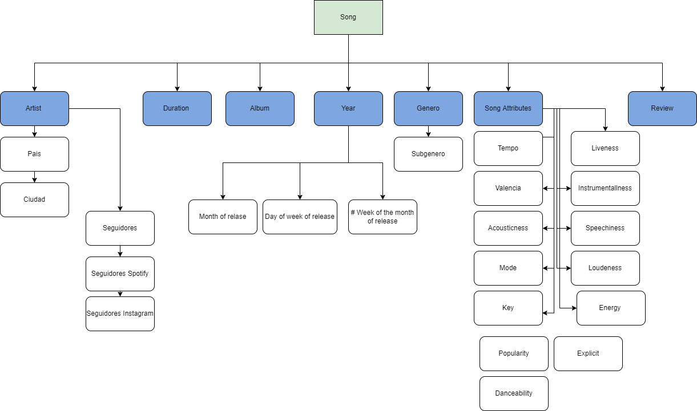

# Bases de Datos Relacionales 
#### Nombre: Joel Alejandro Rodarte Rivera  
#### Matricula: 2173260
#### Fecha: 19/09/2022
 

**Tarea 1**
------
El repositorio donde se podrá encontrar todas las tareas de esta clase se encuentran en al siguiente liga: 
> https://github.com/JoeAM11/https---github.com-JoeAM11-BaseDatosRelacionales_JoelRodarte

La base de datos a utilizar sera la siguiente: 
> https://www.kaggle.com/datasets/paradisejoy/top-hits-spotify-from-20002019

Descripcion base de datos: 

La base datos contiene información de las 2000 canciones más reproducidas en Spotify y que hayan sido lanzadas entre los años 1999 y 2019. A continuación una descripcion de la informacion disponoble de cada cancion, su significado y su clasificacion de tipo de datos para la base de datos. Para cada una de estas variables, considero que es importante hacer un esfuerzo por entender como fue la metodología para dictaminar su valor de variable; Esto es especialemente cierto para popualrity, energy and valence. 

La mayoria de las variables tienen relacion directa con la cancion. Si se deseara entender cuales son las caracteristicas que hacen que una cancion sea popular tendriamos que evualuar las variables mencionadas en la Siguiente tabla. Una cancion le pertenece a un artista y fue lanzada en un año ese especifico. Cada cancion pertenece a un único valir de duracion y album. Para cada cancion tendria como atributo las variable de explicito, popularidad, bailavilidad, energia, llave, ruidosa, modo, speechiness, acustica, instrumentalismo, liveness, valencia, tempo y genero. A esta informacion tengo planeado agregar pais y ciudad relacionada con el artista. Al mismo artista agregarle seguidores en spotify/Instagram/ Facebook.  Al genero planeo agregar subgenero. A la fecha de salida agregarle una fecha de salida por dia de la semana (1-7) asi como numero de semana (1-4). Añadiré review de Metacritic (0-100) relacionado a la cancion. 

| Variable     | Tipo de Variable | Descripcion Variable    | 
| :---        |    ----:   |          :--- |
| **artist**     | VARCHAR      | Nombre del artista  |
|**Song**   | VARCHAR        | Nombre de la cancion      |
| **Duracion**   | VARCHAR       | Duracion canción en milisegundos    |
| **Explicit**   | TINYTEXT      | Clasifica si la cancion o video musical contiene una o mas referencias a contenido que puede ser considerada ofensiva o no apropiada para niños    |
| **Year**   | VARCHAR       | Año en que fue lanzada la cancion      |
| **Popularity**   | VARCHAR        | Valor numero en el cual entre más alto sea, mayor es su popularidad.      |
| **Dancability**   | VARCHAR       | Describe que tan bailable es una cancion. Entre mayor sea su valor, más bailable. Algunos factores que afectan son el tempo, sensibilidad de ritmo, fuerza del beat, y regularidad. Entre 0 y 1.     |
| **Energy**   | VARCHAR       | Medida entre 0 y 1 que representa la percepcion de inetensidad y actididad de la cancion.     |
| **Key**   | VARCHAR     | Mapas para intepretar el pitch de una cacion. Los valores pueden tomar por ejemplo : E.g. 0 = C, 1 = C♯/D♭, 2 = D, and so on. y -1 si no se detecta ninguna llave musical.      |
| **Loudness**   | VARCHAR        | Nivel de ruido de la pista medida en decibeles. Este valor promedia el valor de decibeles en la pista completa.      |
| **Mode**   | VARCHAR        | Modalidad de la pista (Escala mayor o menor). Mayor = 1 y Menor = 0.      |
| **speechiness**   | VARCHAR        | Medida de la presencia de palabras en la cancion. Entre mayor sea el numero significa que es una pista que se basa mas en cantar o samples. Valores bajos indican que el alma de la cancion es más musical.      |
| **Acousticness**   | VARCHAR        | Medida de que tan acustica es una pista. Valor = 1 representra una cancion acustica.     |
| **Instrumentallness**   | VARCHAR        |  Prediccion si la cancion NO contiene o no vocales. "Ooh" "Aah" es considerada vocales. Rap es considerada vocal por lo que tendria un valor alto. Morat por ejemplo tendria un valor bajo.      |
| **Liveness**  | VARCHAR        |     Detecta la presencia de audiencia en la pista. ALtos numeros represntan que la pista proabblemente este grabada en vivo.     |
| **Valencia**   | VARCHAR        | Medidad de 0 a 1 que mide que tan positva es la cancion. Entre mayor sea el numero se asocia a sentimientos de felicidad y euforia. Una valor bajo representa una cancion triste,deprimida o enojada.       |
| **Tempo**   | VARCHAR        |     Tempo de la cancion en BPM (Beats per minute)
| **genre**   | TINYTEXT        |     Genero de la caciones. 

  

  

> SGBD --> Sistema Gestor de Base Datos  
  SQL = Stuctured Query Language 

 

ALgunas de las opciones más conocidas, por mencionar algunas,  del mercado son: 

* Microsoft Access
* Microsoft SQL Server 
* MySQL
* Oracle Database
* OrientDB 
* MariaDB 
* MongoDB
* PostGreSQL

 

> Para esta clase he decidido utilizar **MySQL** como mi gestor de base de datos. 

 

* Es mi primera experiencia con una base de datos por lo que cualquier gestos aportara mucho a formar nuevos conocimientos. Me interesa este en particular para que sea más fácil ver los errors e historias de exito que expongan mis compañeros para poder replicarlo. 
* My SQL es un tipo de base de datos de tipo relacional, lo cual quiere decir que sus datos se estructuran en filas de tabla. 
* La version gratis es adecuada para el uso que se le dará en clase y esta soportada por Oracle. 
* Al ser una de los SGBD más populares del mercado, estoy esperando que su comunidad en linea sea amplia y se puedan resolver dudas con posts del pasado o hacer triubleshooting colaborativo a través de internet. Existen muchos foros con mucho potencial de aprendizaje para MySQL. 
* Es multiplataforma, es decir si el dia de mañana cambio de sistema operativo podré seguir con mi trabajo. Ademas para compartir informacion con otros compañeros de otros sistemas operativos, esto quita barreras. 
* Encontre referenciado que MySQL tiene una interfaz grafica decente, algo que aprecio mucho sabiendo que no tengo un backgroudn de programacion.
* Muchos foros constatan que los requerimientos de hardware son bajos para poder hacer proyectos poderosos. 
* Estas ventajas y que el modelo relacional es lo que mas hemos cubierto en clase me ha llevado a tomar la desicion de utilizar MySQL.

