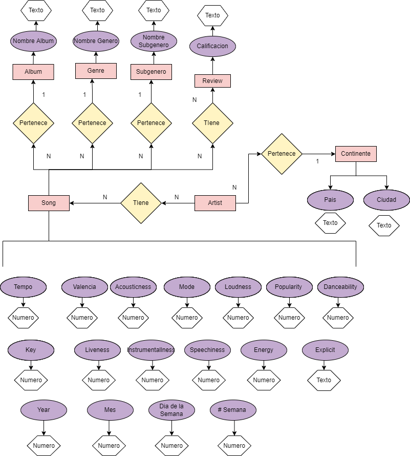

# Bases de Datos Relacionales 
#### Nombre: Joel Alejandro Rodarte Rivera  
#### Matricula: 2173260
#### Fecha: 22/09/2022
 

# Tarea 2 
 

La tarea 2 tiene como objetivo **realizar un diagrama Entidad relacion con la base de datos elegida en la tarea 1** que se puede encontrar en este mismo repositorio. 

Relaciones: 
* Un continente puede pertenecer a varios artistas / Un artista pertenece a un continente
* Un artista tiene varias canciones / Una cancion tiene un artista 
* Una cacion salio en un año / En un año salieron varias canciones
* Una cancion pertenece a un album / Un album tiene varias canciones 
* Una cancion tiene un genero / Un genero puede tener varias canciones
* Una cancion tiene un review / Una calificacion puede ser usada en varias canciones 
* Una cacion tiene unos atributos / Unos atributos describen a una cacion. 

Lecciones aprendidas:

* Respecto a la tarea 1 he eliminado la variable de seguidores en redes sociales puesto que es un atribute que cambia con el tiempo y no cumple con la definicion de una entidad. 
* De ser necesario tener mas relaciones,al artista le puedo agregar la fecha en la que inicio la banda. Probablemente especificando solamente el año. 

Upgrades después de clase: 
* Cambiar y unir todos los atributos de la cacione directamente a la entidad Song.
* Añadir una entidad nueva de subgenero en lugar de ser un atributo de genero, esto para mejor y más fácil manejo de datos. 
* Añadí las relaciones que había olivdado añadir (1-N o N-N)