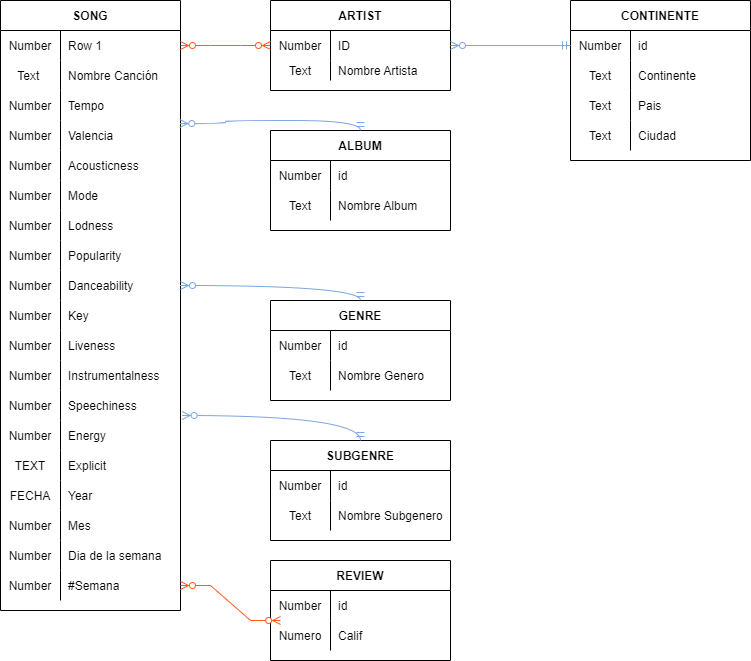
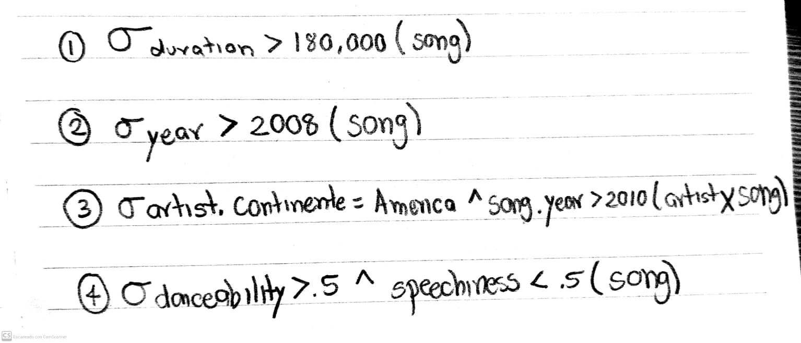

# Bases de Datos Relacionales 
#### Nombre: Joel Alejandro Rodarte Rivera  
#### Matricula: 2173260
#### Fecha: 25/09/2022
 

# Tarea 3
 

La tarea 3 tiene como objetivo:
* Crear un modelo de esquema relacional basado en el modelo e-r de la clase anterior
* Hacer un diagrama relacional del punto anteior
* Plantear 4 operaciones expresadas mediante operadores del algebra relacional. Explicar que es lo que realizan tales operaciones 

 

**Esquema**

 

Artist( <ins>id_Artist</ins> , name)
 
Continente( <ins>id</ins> ,continente, pais ,cidudad ,id_Artist)

Song(<ins>id_song_</ins> , name ,Tempo ,Valencia ,Acousticness ,Mode , Loudness ,Popularity ,Danceability ,Key , Liveness , Instrumentallness ,Speechiness ,Energy ,Explicit ,Year ,Mes ,Dia de la semana , # Semana)

Artist_Song(<ins>id_Artist</ins> ,id_song)

Album( <ins>id</ins>,nombre,id_song)

Genre( <ins>id</ins>,nombre,id_song) 

Subgenre( <ins>id</ins>,nombre,id_song)

Review(<ins>id</ins>,calificacion,id_song)

 

**Diagrama Relacional**

 

 

**Operaciones**

 

1. Extraer canciones que duren mas de 3 minutos

2. Extraer canciones que hayan sido lanzadas despues de 2008 (lazanmiento de SPotify)

3. Canciones que pertenezcan a artistas que sean de America y sean del 2010 en adelante 

4. Canciones que sean bailables (>.5 Danceability) y que tengan valor bajo de Speechiness (<.5 speechiness).

 

Dudas al 25/09/2022: 

1. Para las entidades que solo tienen un atributo en el modelo entidad relacion seria solo poner su id y su nombre? o solo un id
Ejemplo: Album (id, nombre) o Album(id)
Lo mismo sucede con artist, genre, subgenre,review
2. En continente necesito un ATRIBUTO que se llame continente? 
3. Cuando SI tengo que crear una tabla extra en mucho a muchos. Cuando en la tabla de mucho a mucho tambien tengo atributos unicos para esa nueva tabla? 
4. ¿Como se podria hacer un contador? Es decir al sacar la tabla de los artistas, como contar el que mas se repita. 
4. Practicar las operaciones algebraicas en el formato de instruccion de computadora, a mano parece ser quedo claro. 